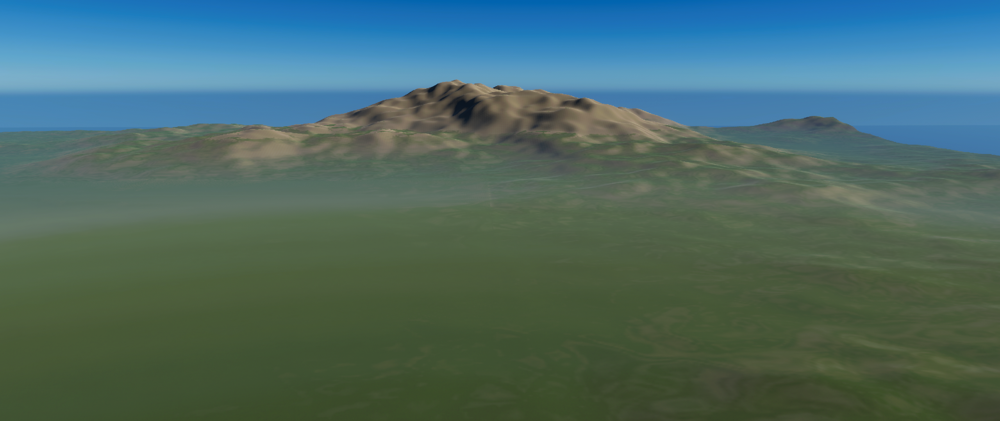

# Map Generator

This program uses simplex noise to generate map heightmaps suitable for the City Skylines 2 Map Editor.

To set everything up:
* install a python3 virtual environment
* clone the map maker repo
* use pip to install required libraries, `pip install -r requirements.txt`

To run the program using the following command:
```
python map.py --seed [SEED] --it [IT]
```
Replace SEED with your random number seed and IT with the number of maps (iterations) you want.
The program will generate pairs of PNG images, `map[it]_wm.png` and `map[it]_hm.png`
being the world and height maps respectively. These files can be copied to your CS2 heightmaps
folder (`C:\Users\USERNAME\AppData\LocalLow\Colossal Order\Cities Skylines II\Heightmaps` on my PC)
and then imported in the map editor.

Notes:
* The map generator will try and create mountain/hill areas, a flat area intersecting the starting square,
  and a sea level drop off.
* Sometimes the playable area is completely flat with distant mountains -- either keep this if its what you want
  or generate another map.
* Sometimes the playable area does not have enough flat space -- either move the starting square or scale the height
  of the map in the map editor if this happens.
* Generally its a good idea to generate 30+ maps at a time and pick the interesting ones to look at in the map editor.


## Sample maps

| seed | it | world                            | height                           |
|------|----|----------------------------------|----------------------------------|
| 619  | 1  |  |  |
| 619  | 4  |  |  |

### Map 1 after loading into the map editor:

### Map 4 after loading into the map editor:

### Map 1 after loading into the map editor and adding water and a few highways:


